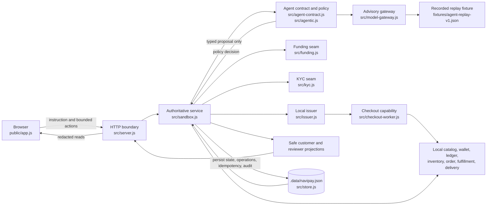

# NaviPay

> **Current stage: P0 local-only commerce sandbox and truthful agentic
> contract**
>
> Baseline reviewed: default-branch commit `303ec52`, **Add truthful P0 agent
> replay and reviewer proof**.

NaviPay turns one plain-language purchase instruction into a bounded,
inspectable local commerce run. It is a **local-only commerce sandbox and
truthful agentic contract**, not a live payment, custody, KYC, merchant,
marketplace, or delivery product.

Every wallet, catalog item, merchant, card, checkout, funding event, KYC
decision, order, fulfillment update, delivery update, and model response in this
repository is simulated or recorded locally. The demo is designed to make
authority, evidence, recovery, and redaction visible without pretending that a
local fixture proves a live provider event.

## At a glance

| Area                  | P0 reality                                          |
| --------------------- | --------------------------------------------------- |
| Primary interaction   | One instruction, one bounded local run              |
| Commerce source       | Seeded catalog; optional read-only browser evidence |
| Money                 | Fake XSGD wallet and local ledger                   |
| Agent mode            | Recorded replay or deterministic fallback           |
| Side-effect authority | Server policy and local adapters                    |
| Primary presentation  | User mode: one sentence in, concise result out      |
| Technical presentation | Developer mode: evidence and local controls        |
| User artifact         | User outcome and receipt projection                |
| Reviewer artifact     | Four-stage read-only evidence                      |
| Persistence           | Version 2 local JSON store                          |
| Runtime               | One Node.js process on `127.0.0.1`                  |

## Product brief

### Problem

A purchase agent sits across several trust boundaries: interpreting an
instruction, finding an item, checking a quote, reserving stock, checking
funding and KYC eligibility, authorizing payment, creating an order, and
reporting what happened. A plausible-looking success message is not enough.
Reviewers and contributors need to see which system made each decision, what
evidence is local, what was persisted, and how unknown or partial outcomes are
handled.

NaviPay provides a small, repeatable vertical slice for evaluating those
boundaries. The local implementation favors truthful state over an impressive
but unverifiable automation story.

### Target demo and users

- **Captain, organizer, or reviewer:** run one purchase, inspect the customer
  result, then open the reviewer projection to verify provenance, policy, tool
  facts, checkpoints, and safe event identities.
- **Contributor or design and engineering team:** use the seeded fixtures and
  deterministic scenarios to understand the contracts, build UI or adapter
  changes, and prove that a failure did not become a false success.
- **User:** enter one natural instruction, see a calm status and receipt, and
  take only the next action the server exposes.

### Goals

1. Demonstrate one bounded purchase from instruction to receipt using local,
   deterministic seams.
2. Keep the server authoritative for interpretation, quote, budget, inventory,
   authorization, payment, order, fulfillment, delivery, and projections.
3. Make recorded agent provenance and the boundary between advisory proposals
   and authorized side effects reviewable.
4. Preserve truthful task state through reload, idempotent replay, unknown
   payment, compensation, refund, reversal, and delivery failure.
5. Keep browser and reviewer responses useful while excluding credentials, raw
   provider payloads, raw page content, and unsafe model data.

### MVP presentation modes

**User mode** is the primary presentation and the minimal path for a person who types what they want to buy in one sentence and receives a concise result.

User mode uses plain language and hides implementation jargon and technical evidence without changing account access, authorization, purchase rules, or safety boundaries.

The user-facing lifecycle is intentionally compact: NaviPay **understands** the request, **finds** a matching seeded item, **pays** only after server checks approve the exact purchase, and **delivers** the local order with a truthful result.

These four concepts describe the validated wireframe direction, not a claim that the Lavish wireframe is shipped production UI.

**Developer mode** is the technical presentation layer for the same purchase flow.

It may expose evidence, lifecycle detail, and safe local controls for fake funds and seeded inventory, but it is not a separate authorization, account-access, or purchase-approval surface.

The shipped product uses the existing presentation preference and API contracts described below; mode selection changes presentation only.

### MVP intent handling

Local deterministic matching remains the current MVP path for interpreting bounded purchase requests and selecting seeded catalog candidates.

A future optional LLM interpretation adapter may help translate natural language into a bounded proposal, but an LLM must never become the authority for payment, authorization, inventory, or purchase safety.

No LLM integration is shipped by this README update, and the recorded replay and deterministic fallback remain the current agent paths.

### Non-goals

NaviPay is not currently:

- a live wallet, bank, card issuer, payment processor, custody service, or
  settlement system;
- a KYC, AML, sanctions, identity, or customer verification service;
- a marketplace, merchant network, production inventory system, or live order
  platform;
- a live XSGD or blockchain integration;
- a live merchant checkout, Amazon integration, external carrier, or external
  delivery network;
- a hosted-model product or unrestricted browser automation system;
- a production-concurrency or operational-reliability claim.

## Current scope and deliberate boundary

### P0: implemented now

P0 is the current judgeable stage:

- One instruction, one purchase purpose, XSGD currency, and a hard local task
  ceiling of XSGD 1,000.
- Natural request parsing with hard brand, product, category, quantity, and
  budget constraints. The purchase policy authorizes exactly one unit.
- Seeded local catalog coverage for keyboards, mice, and earphones, with local
  merchants, quote arithmetic, stock, tax, shipping, and deterministic ranking.
- Quote and cart snapshots with expiry, line details, budget status, and a
  stable snapshot hash.
- Inventory reservation before any payment attempt, with lease, commit, release,
  expiry, and idempotent references.
- A credential-free mock KYC and mock XSGD funding boundary. A normal first
  concrete purchase may bootstrap a simulated local KYC approval for the demo;
  explicit pending and rejected fixtures remain hard stops.
- A scoped local disposable-card lifecycle and a fresh local checkout worker.
  The card capability is process-local and the default issuer capture performs
  the single fake-wallet debit.
- Balanced local wallet ledger legs, merchant-credit confirmation, idempotent
  order creation, independent fulfillment and delivery states, and a persisted
  receipt.
- A versioned safe customer projection with `customerOutcome`, bounded
  `nextActions`, task-owned financial snapshots, a redacted timeline, and a safe
  receipt adjustment.
- A P0 agent contract with a checked-in recorded replay and deterministic
  fallback, server policy evaluation, normalized events, checkpoints, and
  read-only reviewer evidence.
- Optional bounded Playwright discovery that can provide read-only
  recommendations only after server allowlisting and catalog matching; the
  shipped demonstration uses a local replay site.

### P1 and P2: future extension boundaries

These labels describe extension boundaries, not partially enabled providers:

- **P1 provider-backed boundaries:** live XSGD funding, real KYC, hosted models,
  real card issuance, and custody. Each requires an approved provider contract,
  exact status and webhook semantics, credential handling, reconciliation rules,
  and deployment credentials. No local mock result is evidence of any of these.
- **P2 external commerce and operations:** live merchant checkout, Amazon, live
  inventory and order APIs, and external delivery. Each requires an approved
  official or partner contract, terms-compliant capabilities, credentials,
  provider-specific failure behavior, and a separate adapter. Amazon is not
  scraped in this repository.

Until those contracts are approved and implemented, local adapters remain the
default and the product must continue to disclose simulation.

## Primary user journey

The normal path is `POST /api/purchases/run`. The browser can request this
operation, but it cannot choose a price, create a card credential, authorize a
side effect, or write lifecycle state. The server validates and persists every
transition.

1. **Instruction and authorization envelope.** The server accepts bounded plain
   text, parses product type, brand, quantity, currency, keywords, and optional
   budget, then stores the original instruction alongside a versioned
   authorization envelope. Unsupported currency, malformed quantity, unsafe
   requests, and missing product type stop before payment; any temporary
   reservation is released.
2. **Discovery.** `LocalDiscoveryAdapter` ranks the seeded catalog by hard
   constraints, category, brand, keywords, stock, and stable catalog order. A
   genuine tie pauses for an item choice. An exact brand or product request is
   never silently substituted with another item.
3. **Quote lock.** The server selects the clear eligible candidate and locks the
   merchant, item, variant, quantity, price, shipping, tax, total, currency,
   quote ID, cart ID, expiry, and snapshot hash. The browser never supplies the
   authoritative total.
4. **Inventory.** The server reserves one unit with a lease before payment. Out
   of stock, over budget, stale quote, and selection failures stop without an
   unconfirmed payment.
5. **Funding and KYC boundary.** The purchase checks the seeded fake wallet
   through the local funding adapter and checks the local mock KYC gate
   immediately before authorization. The separate funding routes can create and
   simulate mock deposit intents after explicit local KYC approval. Neither path
   proves identity, custody, a blockchain transaction, or live XSGD.
6. **Server authorization.** The policy engine evaluates the fresh exact quote,
   hard constraints, budget, inventory, KYC status, fake-wallet balance,
   merchant scope, category, quantity, and local risk checks. Only this server
   decision can approve the downstream instrument and execution steps.
7. **Scoped local issuer.** On approval, the local issuer creates a one-use
   instrument scoped to the selected local merchant, domain, exact amount, XSGD,
   category code, expiry, and one successful capture. The credential is held in
   an isolated process-local capability, not in a task, audit event, projection,
   log, fixture, or browser response.
8. **Checkout simulation.** A fresh per-task local checkout worker submits the
   locked product, cart, delivery fixture, and isolated card capability to the
   local merchant gateway. This is a deterministic local checkout simulation,
   not a real browser checkout or external merchant.
9. **Authorization and capture.** The local issuer checks merchant, amount,
   currency, category, expiry, and one-use scope. A successful capture performs
   one fake-wallet debit. A decline is terminal. An unknown result becomes a
   durable reconciliation state and is never blindly retried.
10. **Ledger and merchant credit.** A successful capture writes one balanced
    pair of local ledger legs: wallet debit and merchant credit. Merchant-credit
    confirmation verifies the existing ledger credit and is not a second debit.
11. **Order, fulfillment, and delivery.** An idempotent order is created only
    after confirmed payment and committed inventory. Fulfillment and delivery
    are independent statuses. A delivery failure does not rewrite a confirmed
    payment or order.
12. **Receipt and customer outcome.** The server persists the receipt and a
    plain-language outcome. The receipt is the primary success artifact and
    includes immutable capture facts, price, payment, order, preparation,
    delivery, and safe references. A later refund or reversal appears as a
    current adjustment without rewriting the original capture snapshot.
13. **Reviewer evidence.** The reviewer route separates the run into Funding,
    Discovery, Issuance, and Execution. Funding says local mock evidence only.
    Execution says local checkout simulation only. Neither label is a provider
    claim.

### What the browser can and cannot do

`public/app.js` renders server-owned projections and submits bounded requests.
It may ask the server to start a purchase, select a candidate, reconcile an
unknown payment, or request a local refund or reversal. It cannot set a quote or
balance, mutate a task directly, issue or read a credential, approve policy,
invoke an adapter, or turn browser discovery into checkout authority. The server
validates every requested transition, enforces idempotency, and returns redacted
projections.

## Agent mode and reviewer proof

The default P0 mode is `recorded_replay`.
[`fixtures/agent-replay-v1.json`](fixtures/agent-replay-v1.json) is a versioned
response bundle validated against its embedded SHA-256 signature. It contains
model-shaped typed proposals for bounded local plans, not a live model response.
`deterministic_fallback` is a network-free, credential-free alternative selected
with `agentMode: "deterministic_fallback"` or
`NAVIPAY_AGENT_MODE=deterministic_fallback`.

Both modes are **advisory**. A proposal can contain typed intents and
allowlisted tool proposals, but it cannot authorize inventory, card issuance,
checkout, payment, order, or receipt side effects.
[`src/agentic.js`](src/agentic.js) validates the proposal and records the policy
decision. The business authorization in [`src/sandbox.js`](src/sandbox.js) and
the local adapters are authoritative.

The four reviewer stages are:

- **Funding:** local mock funding observation and an explicit no-live-XSGD
  disclosure.
- **Discovery:** bounded candidate, quote, ranking, and snapshot evidence.
- **Issuance:** server-approved one-use local instrument scope and safe card
  status.
- **Execution:** local checkout, capture, ledger, merchant credit, order,
  fulfillment, delivery, and receipt facts.

The User projection exposes only a compact mode disclosure and stage
statuses. The read-only reviewer projection exposes the typed proposal, safe
context summary, server policy decision, allowlisted tool registry, safe
observations, safe tool facts, evidence references, hashes, budgets, retries,
checkpoints, stage transitions, final outcome, and event identities. It does not
expose the raw prompt, raw page text, provider payload, credential, or mutation
control. See [`src/agent-contract.js`](src/agent-contract.js),
[`src/model-gateway.js`](src/model-gateway.js), and
[`src/agentic.js`](src/agentic.js) for the exact contracts.

## Architecture overview

The detailed lifecycle, data model, failure semantics, and extension rules are
in [`docs/architecture.md`](docs/architecture.md). This diagram is the
high-level entry point.



### Module map

- [`src/server.js`](src/server.js) is the single-host entrypoint. It owns HTTP
  routing, request-size and error handling, local simulation authorization, and
  safe JSON responses.
- [`src/sandbox.js`](src/sandbox.js) owns the seeded catalog, orchestration,
  authorization envelope and decision, local adapters, lifecycle transitions,
  financial truth, receipt, customer projection, and reviewer projection
  assembly.
- [`src/store.js`](src/store.js) owns the version 2 in-memory and JSON
  persistence boundary, migration, validation, and atomic restricted-file
  writes.
- [`src/agentic.js`](src/agentic.js) owns safe context, observations,
  allowlisted tool proposals, policy decisions, stage transitions, append-only
  agent events, checkpoints, and reviewer projection helpers.
- [`src/model-gateway.js`](src/model-gateway.js) owns the provider-neutral P0
  gateway and the recorded replay and deterministic fallback implementations.
- [`src/issuer.js`](src/issuer.js) owns the local one-use instrument lifecycle.
  [`src/checkout-worker.js`](src/checkout-worker.js) owns the fresh bounded
  local checkout capability and cleanup metadata.
- [`src/funding.js`](src/funding.js) and [`src/kyc.js`](src/kyc.js) define
  replaceable provider-neutral seams backed by explicit local mock
  implementations.
- [`public/app.js`](public/app.js) is the customer UI. It consumes projections,
  keeps secondary evidence collapsed, and does not make business or payment
  decisions.

## Persistence and data truth

### State and snapshots

The local store is version 2 and migrates version 1 state on load. It persists
tasks, progress, operations, idempotency responses, wallet transfers,
double-entry ledger legs, merchant credits, inventory reservations, orders,
fulfillment and delivery records, issuer metadata, checkout sessions and webhook
fixtures, refunds, funding intents and events, KYC state, agent runs, normalized
agent events, and checkpoints.

`JsonStore` writes to a restricted directory and file, writes through a
restricted temporary file, calls `fsync`, and atomically renames the result.
This supports local reload and recovery. It is still a single-process JSON store
and does not claim transactional database concurrency or production durability.

Each task owns its financial snapshot. The projection records
`balanceBeforeMinor`, `balanceAfterPaymentMinor`, `finalBalanceMinor`,
`netChargedMinor`, `netRefundedMinor`, compensation, and financial outcome when
known. A task with no payment snapshot does not inherit the current global
wallet balance. The global wallet endpoint is separate evidence.

Locked quotes persist quote ID, cart ID, line snapshot, exact arithmetic,
expiry, budget status, and snapshot hash. Inventory reservation and order
confirmation validate that snapshot, so a later or browser-supplied amount
cannot widen the purchase.

### Projections and redaction

The legacy `task` shape remains in responses for compatibility. The versioned
`projection` is the browser contract and is rebuilt from task-owned facts by
`src/sandbox.js`. It contains interpreted request data, safe candidate evidence,
quote and reservation facts, financial snapshots, safe payment and card
lifecycle, order, fulfillment, delivery, receipt, operations, a redacted
timeline, `customerOutcome`, bounded `nextActions`, and a compact agent
disclosure.

Reviewer routes use a separate projection. Normalized agent event envelopes
retain sequence, actor, stage, idempotency identity, payload hash, and previous
hash. `GET /api/tasks/:id/events` returns event identities without event
payloads. Checkpoints make restart state inspectable. `rebuildProjections` and
the agent event log rebuild customer and reviewer read models without exposing
raw model or provider content.

### Idempotency, reconciliation, and compensation

- Purchase and action routes accept `Idempotency-Key`. The key and input
  fingerprint are persisted. Replaying the same key returns the stored response;
  reusing a key with different input is rejected.
- Adapter operations use stable operation IDs and references. Inventory leases,
  wallet transfers, captures, orders, funding credits, webhook events, refunds,
  and reversals are looked up before new side effects.
- An unknown payment keeps the reservation, moves the task to reconciliation,
  and blocks automatic retry. `POST /api/tasks/:id/payment/reconcile` resolves
  the existing issuer result as `authorized` or `declined` without replaying
  checkout or creating a second transfer.
- Merchant-credit, order, and inventory-commit failure after capture uses a
  compensating local ledger transfer and releases stock where possible. If
  compensation itself fails, the task stays truthfully charged and records the
  failed compensation instead of claiming that money was returned.
- A refund or reversal is one idempotent local post-capture adjustment. It
  updates current payment and net amounts, while the original receipt capture
  snapshot stays immutable.

## Failure semantics

The service includes deterministic scenario fixtures used by tests and API
demonstrations. Representative outcomes include no match, missing product type,
unsupported quantity, ambiguity, exact out of stock, over budget, stale quote,
pending or rejected KYC, insufficient funding, policy block, payment decline,
unknown payment, wrong merchant, amount overage, expired card, browser crash,
merchant-credit failure, order or inventory commit failure, fulfillment failure,
and delivery failure.

The important customer truths are:

- **Before capture:** invalid request, no match, ambiguity, over budget, stale
  quote, out of stock, KYC or policy block, insufficient funds, and decline stop
  before an unconfirmed payment. Reservations are released when one exists. No
  confirmed order or receipt is invented.
- **Unknown payment:** the task says that payment status needs confirmation. No
  automatic retry occurs. An authorized reconciliation continues from the
  persisted adapter truth; a declined reconciliation retires the local
  instrument and releases inventory.
- **Fulfillment or delivery failure:** confirmed payment and order remain
  confirmed. The independent preparation or delivery status shows attention is
  needed, and the receipt remains available.
- **Refund or reversal:** the original purchase remains visible as an immutable
  capture record next to a current payment adjustment. Commerce history is not
  rewritten.
- **Reload and checkpoint recovery:** persisted task state can resume a safe
  local run. A disposable credential is not persisted. If a process-local
  capability cannot be safely recreated from its stored scope, the run stops
  rather than reusing an unverified credential.

## API and contract index

The route handlers in [`src/server.js`](src/server.js) and projection builders
in [`src/sandbox.js`](src/sandbox.js) are authoritative for exact schemas,
status codes, and errors. Send `Idempotency-Key` on every mutating request.

| Surface            | Endpoint                                |
| ------------------ | --------------------------------------- |
| Primary purchase   | `POST /api/purchases/run`               |
| Resume selection   | `POST /api/tasks/:id/run`               |
| Task projection    | `GET /api/tasks/:id/projection`         |
| Reviewer proof     | `GET /api/tasks/:id/reviewer`           |
| Reviewer by run    | `GET /api/runs/:runId/reviewer`         |
| Receipt            | `GET /api/tasks/:id/receipt`            |
| Payment reconcile  | `POST /api/tasks/:id/payment/reconcile` |
| Payment refund     | `POST /api/tasks/:id/payment/refund`    |
| Payment reverse    | `POST /api/tasks/:id/payment/reverse`   |
| Funding and KYC    | `/api/funding` and `/api/funding/kyc`   |
| Catalog and wallet | `/api/catalog` and `/api/wallet`        |
| Simulation resources | `GET /api/simulation/resources`       |
| Developer top-up  | `POST /api/wallet/simulated-top-up`     |
| Developer restock | `POST /api/simulation/resources/restock` |
| Reset              | `POST /api/reset`                       |
| Optional discovery | `/api/discovery` and `targetSite`       |

Contract notes:

- The primary run accepts `{ "request": "..." }` plus optional `targetSite`,
  `scenario`, `paymentMode`, and `agentMode`. Resume accepts a `candidateId`.
- `GET /api/tasks`, `GET /api/tasks/:id`, and `GET /api/tasks/:id/audit` provide
  history, the compatibility task shape, and safe audit events.
  `GET /api/tasks/:id/events` and `GET /api/tasks/:id/checkpoint` provide safe
  agent identities and checkpoint state.
- Reconcile accepts `{"resolution":"authorized"}` or
  `{"resolution":"declined"}`. Refund and reverse are empty-body local actions.
- Funding includes `POST /api/funding/intents`, `GET /api/funding/intents/:id`,
  `POST /api/funding/intents/:id/simulate`, `POST /api/funding/webhooks`, and
  `POST /api/funding/reconcile`. KYC has matching `/api/funding/kyc/simulate`,
  `/webhooks`, and `/reconcile` routes. Simulation requires
  `X-NaviPay-Local-Simulation: true`; provider routes also require the
  configured provider identity and appropriate server-side authorization.
- `targetSite` is optional on the purchase run. The server validates its URL and
  allowlist before the bounded browser worker can read it. The worker never gets
  payment or checkout authority.
- Developer mode exposes a **Simulation resources** surface for local scenario
  setup. It groups the fake XSGD wallet with the seeded sandbox inventory while
  User mode renders neither the surface nor its controls. The surface persists
  fake XSGD top-ups and seeded inventory restocks, safely replays the same
  idempotent operation without duplicating it, suppresses these controls from
  the User experience, and supports recovery from an out-of-stock result after
  restocking. The name describes both replenishable local inputs without
  implying custody or live merchant access. The surface is a presentation
  preference, not authentication, authorization, or purchase approval.
- The wallet control calls `POST /api/wallet/simulated-top-up` with a stable
  `Idempotency-Key` and `X-NaviPay-Local-Simulation: true`. It accepts XSGD only,
  credits the server-owned fake wallet through balanced local ledger legs, and
  records a safe top-up reference and audit event. It never starts or approves a
  purchase; use the canonical purchase route afterward. Invalid, zero, negative,
  malformed, or over-limit amounts are rejected by the server.
- `GET /api/simulation/resources` is the canonical safe projection for the fake
  wallet and seeded inventory. Developer restock calls
  `POST /api/simulation/resources/restock` with `{ "sku": "...", "quantity": 5 }`,
  the explicit local simulation header, and an idempotency key. The SKU must be a
  real seeded catalog item and quantity must be a positive whole number of at
  most 100 units per action; available stock is capped at 1,000 units. A restock
  changes available stock only, leaves active reservations and all purchase
  lifecycle records untouched, and records a replay-safe operation and audit
  event. Its response exposes the selected item and available quantity before
  and after the change. This is simulated stock only, not live merchant
  inventory.

Funding examples use the explicit local simulation authorization header and are
deliberately not live-provider instructions:

```sh
# Inspect the local-only funding and KYC projection
curl -sS http://127.0.0.1:3000/api/funding

# Approve the mock KYC gate for local testing only
curl -sS -X POST http://127.0.0.1:3000/api/funding/kyc/simulate \
  -H 'content-type: application/json' \
  -H 'Idempotency-Key: demo-kyc-approve' \
  -H 'X-NaviPay-Local-Simulation: true' \
  -d '{"action":"approve"}'

# Create deterministic mock deposit instructions
curl -sS -X POST http://127.0.0.1:3000/api/funding/intents \
  -H 'content-type: application/json' \
  -H 'Idempotency-Key: demo-funding-create' \
  -d '{"amount":"25.00"}'
```

The mock funding flow uses a `mock://`-style local instruction and makes no
network call. It does not create a blockchain transaction or accept a real
deposit. Do not treat its reference, network label, or confirmation evidence as
provider evidence.

For deterministic insufficient-funds and recovery setup, use Developer mode's
**Add simulated funds** control after a failed purchase. The equivalent
local-only API call is:

```sh
curl -sS -X POST http://127.0.0.1:3000/api/wallet/simulated-top-up \
  -H 'content-type: application/json' \
  -H 'Idempotency-Key: demo-top-up-25' \
  -H 'X-NaviPay-Local-Simulation: true' \
  -d '{"amount":"25.00","currency":"XSGD"}'
```

The top-up response includes the updated fake wallet, balanced simulation ledger
legs, a safe action and transaction reference, and persisted top-up and audit
records. The response also includes the canonical `simulationResources`
projection.
Repeated requests with the same action key replay the original result without a
second credit. The restock response uses the same projection and replay contract.
Both controls are for the documented loopback local simulation only, not a real
funding, custody, or inventory boundary.

## Local setup and validation

### Requirements

- Node.js 20 or newer
- npm
- Python 3 only for the optional local browser replay server
- `chrome-devtools-axi` for `npm run test:ui`

### Run the product

```sh
npm install
npm start
```

Open <http://127.0.0.1:3000> in User mode for the minimal experience, or switch to Developer mode when reviewing evidence and local controls.

Use an example request such as
`buy a Logitech mouse` or `Find an Apple Magic Keyboard`. The default path uses
the seeded catalog and does not require Playwright. After reset, the fake wallet
starts at XSGD 500.00 and the mock KYC profile is pending until the purchase
bootstrap or an explicit local simulation changes it.

The same primary contract can be exercised without the browser:

```sh
curl -sS -X POST http://127.0.0.1:3000/api/purchases/run \
  -H 'content-type: application/json' \
  -H 'Idempotency-Key: demo-keyboard-purchase' \
  -d '{"request":"Find an Apple Magic Keyboard"}'
```

Runtime state is written to `.data/navipay.json`, which is ignored by Git. For a
clean, isolated local run, either reset the sandbox:

```sh
curl -sS -X POST http://127.0.0.1:3000/api/reset
```

or use a separate file:

```sh
mkdir -p .data
NAVIPAY_DATA_FILE="$PWD/.data/navipay-review.json" npm start
```

Do not commit local state or credentials. If a future provider is configured,
inject its server-side secret through deployment configuration such as
`NAVIPAY_FUNDING_WEBHOOK_SECRET` or `NAVIPAY_KYC_WEBHOOK_SECRET`; never put it
in browser code, fixtures, task projections, or tests.

### Validation commands

From the repository root:

```sh
npm test
npm run check
npm run test:ui
```

`npm test` covers lifecycle, authorization, agent contracts, reviewer proof,
discovery, funding and KYC, issuer and checkout, ledger, persistence, recovery,
truthfulness, customer outcomes, HTTP, and frontend contracts. `npm run check`
validates the current JavaScript entrypoints. `npm run test:ui` runs the Chrome
DevTools UI contract across idle, running, success, drawer, narrow, no-match,
delivery-failure, unknown-payment, reconciliation, refund, and reversal states.
The UI runner starts a temporary server and removes its temporary data file.

### Optional Playwright browser-evidence demonstration

This is a local replay of read-only discovery. It is not live merchant browsing
or checkout.

```sh
npm install --no-save playwright
npx playwright install chromium
npm run demo:playwright
```

The demo script starts:

- the fixture site at `http://127.0.0.1:43123/competition-site/` using Python;
  and
- NaviPay with Playwright discovery enabled and `127.0.0.1` explicitly
  allowlisted.

Open <http://127.0.0.1:3000>, expand **Optional product evidence**, set the
target to the fixture URL, and run `Find an Apple Magic Keyboard`. The worker
performs bounded GET or HEAD reads only. It does not click search, checkout,
order, or payment controls, sends no credentials, and cannot reserve stock or
authorize a side effect. NaviPay matches the observed candidate and quote to the
seeded catalog before continuing. If the optional dependency or browser is
unavailable, the product reports the labelled seeded-catalog fallback.

Stop both local processes with Ctrl-C.

## Roadmap and extension rules

The local implementation is intentionally a contract testbed. Any future adapter
must normalize provider facts at the server boundary and preserve:

- server-owned quote, currency, merchant, category, amount, quantity, and
  expiry;
- inventory-before-payment ordering;
- scoped payment capability and provider-controlled credentials;
- stable operation references and idempotent replay;
- explicit unknown, reconciliation, compensation, refund, reversal, and
  terminal-state behavior;
- safe customer and reviewer projections with no raw provider payloads.

Before moving beyond P0, the project needs approved contracts and credentials
for the exact provider methods, identity model, status transitions, webhook
authentication and replay rules, reconciliation endpoints, limits, finality,
custody, KYC/AML responsibilities, refund behavior, and data-retention
requirements. Live XSGD, real KYC, real cards or custody, hosted models, live
merchant checkout, Amazon, and external delivery are all future work. Local mock
funding, mock KYC, recorded replay, fake card, local checkout, and fixture
delivery are evidence of this sandbox only, never proof that a corresponding
live provider event occurred.

For the full technical lifecycle and extension contract, continue to
[`docs/architecture.md`](docs/architecture.md). For implementation, begin with
[`src/server.js`](src/server.js), [`src/sandbox.js`](src/sandbox.js), and the
tests in [`test/`](test/).
